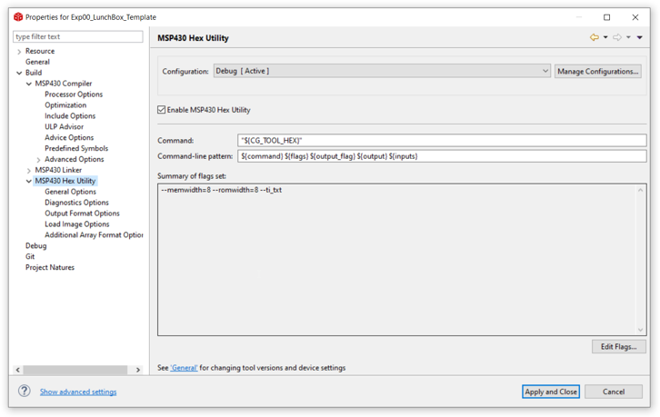
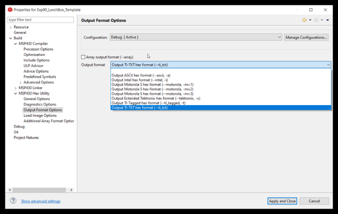
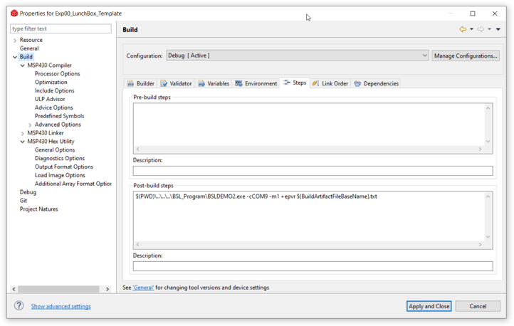

***************
Getting Started
***************

Introduction
============
In embedded projects, The MCU (MSP430 IC) needs instruction to execute. 
These are machine codes, which are very specific to the  architecutre and peripherals available to that specific variant of MCU family. In MSP430 LunchBox scenario, this variant is **MSP403G2553**. 

The video related to installation is hosted on Nptel Swayam course.

What You Need
=============

* Windows system 

Dowload and install following executables on windows machine.

- Latest CCS IDE (Code composer studio) -> `CCS Link <https://software-dl.ti.com/ccs/esd/documents/ccs_downloads.html>`_.

- BSL programmer executable -> `BSL programmer Link <https://www.ti.com/tool/MSPBSL>`_.

.. note::
	- BSL programmer is included in `git respository <https://github.com/ticepd/EmbSysDesign_NPTEL_Course>`_ of NPTEL course. 
	- Adding the path of BSL Programmer in environment variable will make it accessible from everywhere.

Installation Step by Step
=========================

Setting up CCS
~~~~~~~~~~~~~~

Installation steps for CCS is very basic, go with the default selection. 

Only one step to take care is to select the MSP430 ultra-low power MCUs selection in selection menu as shown below.

.. image:: ../../_static/images/Image-a-CCS-Installation3.png
    :align: center

setting up BSL uploading mechanism
~~~~~~~~~~~~~~~~~~~~~~~~~~~~~~~~~~

.. note::
	BSL settings are already done in all the git respository's project.

Right click on project and go to properties.

- step 1

Go to  Build -> Msp430 Hex utility

Enable the MSP430 Hex utility.

- step 2

Go to  Build -> Msp430 Hex utility -> Output Format options

Select the TI-TXT Format

- step 3

Go to  Build -> (TAB) steps

In post build steps add the following line

.. code:: 
	
	$(PWD)\..\..\..\BSL_Program\BSLDEMO2.exe -cCOM9 -m1 +epvr ${BuildArtifactFileBaseName}.txt

-- note::

	The COM port mentioned in last (ie. COM9) will change from system to system. To know the correct value go to Device manager and check the com port value.

Now click on apply and close.

Using git respository's code
~~~~~~~~~~~~~~~~~~~~~~~~~~~~~~~~~~

- step 1 - clone from git respository from github.

.. code::

	git clone https://github.com/ticepd/EmbSysDesign_NPTEL_Course.git

- step 2 - select the workspace to git repo folder which contains examples  (Software\\Examples_Msp430G2553_LunchBox).

- step 3 - By default all the projects will not get included in CCS project explorer plane. To import in project explorer plane, go to File-> import and select examples directory (Software\\Examples_Msp430G2553_LunchBox).

Now all the example codes are visible in project explorer plane.

How to complile the code?
~~~~~~~~~~~~~~~~~~~~~~~~~

right click on project and click build.

How to push the code to MSP430 LunchBox?
~~~~~~~~~~~~~~~~~~~~~~~~~~~~~~~~~~~~~~~~~

Since the code pushing mechanism is added in post build steps. Therfore, right click and press rebuild the project to compile and push thereafter. This step will atomatically trigger the pushing mechanism in itself.