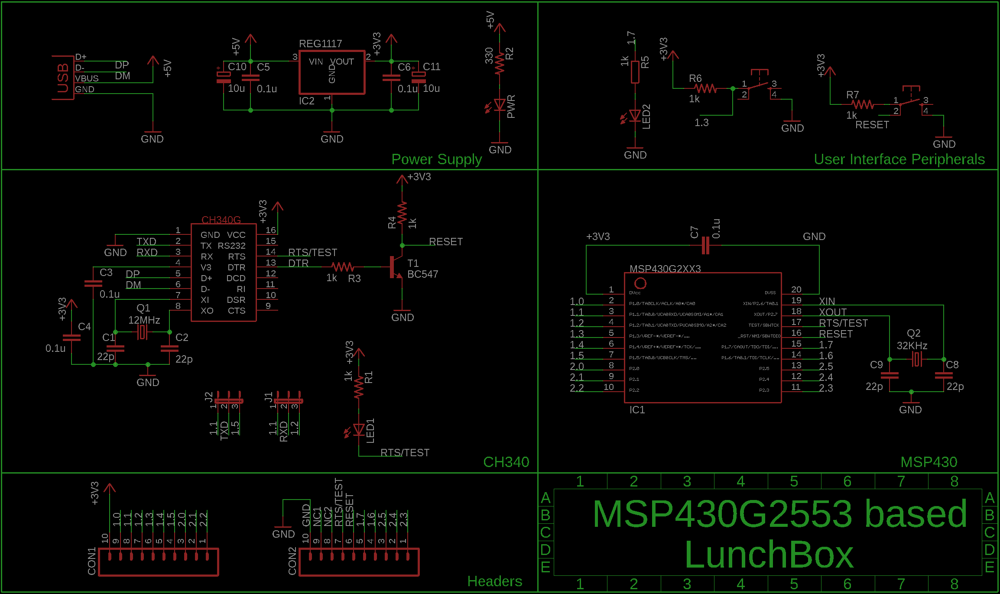

*****************
LunchBox Hardware
*****************

Hardware Description
=====================
.. image:: ../../_static/images/LunchBox_Description.png
    :align: center

Schematic
==========

Pin Description
=====================

source:- MSP430 G2553 Datasheet

Programming mode
================

Before you push the code from ccs to LunchBox, the pin configurations on J1 and J2 should be on side 1.
As shown in picture below.

Communication mode
==================

To recieve the uart data on serial terminal like putty, the pin configurations on J1 and J2 should be on side 2.
As shown in picture below.

.. image:: ../../_static/images/mode-uart.jpg
    :align: center