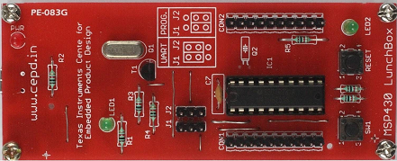

.. MSP430_LunchBox documentation master file, created by
   sphinx-quickstart on Mon Feb  3 15:52:59 2020.
   You can adapt this file completely to your liking, but it should at least
   contain the root `toctree` directive.

################################
MSP430 LunchBox's documentation!
################################

What is MSP430 LunchBox?
========================
MSP430 Lunchbox is an microcontroller platform based on `TI's MSP430G2553 IC <https://www.ti.com/product/MSP430G2533>`_. The TI MSP family of ultra-low-power microcontrollers consists of several devices that feature different
sets of peripherals targeted for various applications. The architecture, combined with five low-power
modes, is optimized to achieve extended battery life in portable measurement applications. The device
features a powerful 16-bit RISC CPU, 16-bit registers, and constant generators that contribute to
maximum code efficiency. The digitally controlled oscillator (DCO) allows the device to wake up from lowpower modes to active mode in less than 1 µs. LunchBox utilises the BSL mode for programming the MCU. 

MSP430 LunchBox was developed at `TI CEPD, Netaji Subhash University of Technology, New Delhi <http://cedtnsit.in/>`_. More details on design and development of this board can be found at this `blog <http://dvgadre.blogspot.com/2017/01/make-yourself-msp430-lunchbox-for-1.html>`_.

MSP430 LunchBox is being manufactured and marketed by `SincGrid LLP <http://sincgrid.in/>`_. 

Where to buy LunchBox and Swayam component kit?
===============================================

MSP430 LunchBox
^^^^^^^^^^^^^^^

.. image:: _static/images/BuyLunchBox.png
	:alt: click to buy
	:target: http://buy.lunchbox.sincgrid.com
	:align: center

Swayam components kit
^^^^^^^^^^^^^^^^^^^^^

To purchase, please visit `Sincgrid Store ( https://store.sincgrid.com/ ) <https://store.sincgrid.com/index.php?route=product/product&path=59&product_id=68>`_.

Github repository
=================
For NPTEL course repository around MSP430 Lunchbox, please visit `https://github.com/ticepd/EmbSysDesign_NPTEL_Course <https://github.com/ticepd/EmbSysDesign_NPTEL_Course>`_.

Course link
===========
There is a course on `'Introduction to Embedded System Design'  <https://swayam.gov.in/nd1_noc20_ee98/preview>`_. This course utilises this MSP430 Lunchbox to demonstrate the various MCU features as well as interfaced peripheral on various pins. This is a core course. It will enhance your understanding of MCU and embedded system designing. In course lecture, Various experiments are performed on LunchBox. The code snippets and experiments mannual from those lectures are shared below.

.. toctree::
   :maxdepth: 2
   :caption: Table of Contents

   files/Hardware_Details/index

   files/Get_Started/index
   files/Experiment_Manual/index

..   files/Prerequisites.rst
..   files/Bare_Minimum_GIT/index
..   files/Bare_Minimum_C/index

